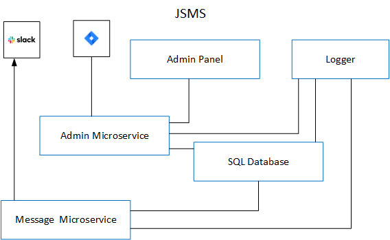
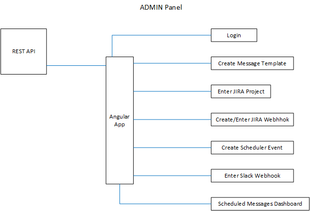
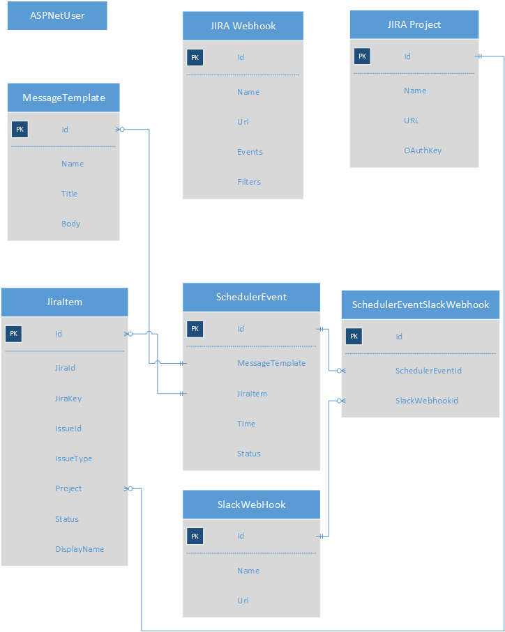
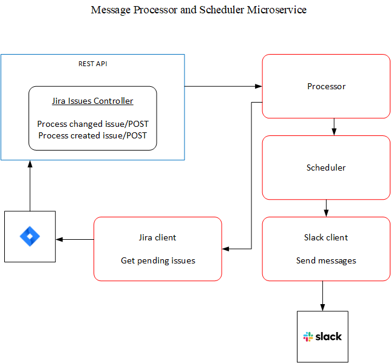
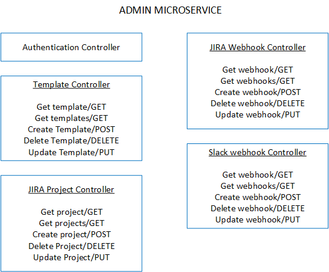

# JIRA & SLACK MESSAGING SERVICE (JSMS)

## Requirements

A Slack channel messaging service based on specific conditions on filtered Jira items.

The messaging service:
- Supports three types of independent message triggers:
	- General schedule based messages (Every second Monday of the month at 10:30 UTC)
	- Jira ticket status update messages (When specific Jira tickets status value is applied)
	- Jira ticket date/time field (One hour before Jira ticket date/time field value)
- Supports multiple Slack channels simultaneous messaging.
- Supports message sending retry in case of failure.

Message composition:
- Messages are template based and dynamically composed supporting static and variable parts.
- The variable parts of the message support different data types: string , number , date, and time 
- The variable parts support set of Jira items’ fields in templated format and are filled based on Jira call filtered response.
- Multiple templates support.

## Overview

JSMS communicates with JIRA API to process the messages and sends the messages to Slack API.
JIRA Api provides webhooks that create event driven REST requests for newly created issues or updated issues. Previously created issues with future dates can be collected by a GET request.
Slack API allows webhooks to be created for each channel where we can get messages sent to a specific URL with no additional authentication.

	
JSMS consists of:
- [Admin Panel](#admin-panel)
- [Admin Microservice](#admin-microservice)
- [Message Scheduler/Processor](message-processor-and-scheduler)
- [SQL Database](#sql-database)
- Logger

## Admin Panel

The Admin Panel is a UI tool for admins to enter information necessary for the JSMS. It can be an Angular app with the following major parts:
- Login
- Create Message Template
- Enter Jira Project
- Create/Enter JIRA Webhook
- Create Scheduler Event
- Enter Slack Webhook

## Scheduled Messages Dashboard

A UI tool showing pending and failed messages
	
## SQL Database
	
The database can have the following tables:
- User
- MessageTemplate
- JiraWebhook
- JiraProject
- JiraItem
- SchedulerEvent
- SlackWebhook

We might need tables or even separate database for the schedule depending on the scheduling framework used.

Expired scheduler events can be archived/removed.

## Message Processor and Scheduler Microservice

We can use either some scheduling framework such as Quartz.NET or create one.

Message templates will include variable parts in curly brackets such as \{IssueId\}.

Sample template: "Issue \{IssueType\} Issue Id: \{IssueId\} from project \{ProjectName\} has change in status from \{OldStatusName\} to \{NewStatusName\}."

General scheduled messages will be defined in the Admin Panel. Message Processor will construct the message and the Message Scheduler will send it on time.

Jira ticket status update messages will be constructed based on the Jira webhooks and the defined in Admin Panel scheduler events. The webhooks will send post requests with the issue changes and the Message Processor will construct the messages and send them to the Scheduler for immediate sending.

Jira ticket date/time messages will be processed in two ways: for existing issues - on start of the processor it will get the issues with future date that are not present in the database and will create the scheduler events; for newly generated issues, the issue will be sent by the JIRA webhook for created issues, the processor will create the scheduler events. 

Message sending retry can be achieved either with retry several times in error handling or even reschedule the sending by changing the date in the event.
 

## Admin Microservice

Rest API and EF to handle the database tables.

## Deployment

Microservices, Admin Panel and the database will be started in Docker containers using Docker Compose and in this way can be easily deployed on any environment either on cloud or on any server suuporting Docker.

## Logging

We can do logging using Serilog, Elastic Search, Kibana and Docker.
